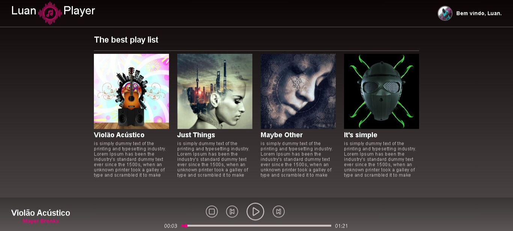

<h1 style=' display: flex;
  align-items: center;
  justify-content: center;
  gap: 5px;'
  >Luan
  
 Player</h1>

 <h2>📕 Sobre</h2>

Um projeto de player de música desenvolvido por mim com objetivo de aprender mais sobre react.js espero q gostem.

<h1>

</h1>

<h2>Como funciona?</h2>

Aqui temos uma interface simples como uma Playlist onde você pode selecionar sua música.
<h1></h1>

Na parte inferior esquerda temos as informações sobre a música e o nome do cantor.

E na parte inferior central temos o painel de controle da música com as funções stop, previous music, play/pause e a next music.

- Stop: Para a música e volta ao ínicio.
- Previous Music: Inicia a música q antecede a atual.
- Play: Inicia a música.
- Pause: Para a música.
- Next Music: Inicia a música seguinte.

